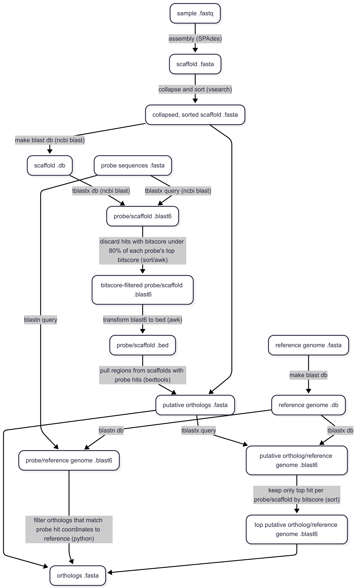

<h1>
  <picture>
    <source media="(prefers-color-scheme: dark)" srcset="docs/images/nf-core-targetassembly_logo_dark.png">
    
  </picture>
</h1>

[](https://github.com/nf-core/targetassembly/actions/workflows/ci.yml)
[](https://github.com/nf-core/targetassembly/actions/workflows/linting.yml)[](https://nf-co.re/targetassembly/results)[](https://doi.org/10.5281/zenodo.XXXXXXX)
[](https://www.nf-test.com)

[](https://www.nextflow.io/)
[](https://docs.conda.io/en/latest/)
[](https://www.docker.com/)
[](https://sylabs.io/docs/)
[](https://cloud.seqera.io/launch?pipeline=https://github.com/nf-core/targetassembly)

[](https://nfcore.slack.com/channels/targetassembly)[](https://twitter.com/nf_core)[](https://mstdn.science/@nf_core)[](https://www.youtube.com/c/nf-core)

## Introduction

**nf-core/targetassembly** is a bioinformatics pipeline that assembles loci from target enrichment sequencing data for the downstream purpose of phylogenetic analysis. As input, it takes sample FASTQ files, a reference genome FASTA file, and probe sequences in a FASTA file. It performs de novo assembly on the sequencing data with SPAdes and searches for orthology with NCBI BLAST. As output, it produces FASTA files for each sample, with each sequence representing a locus.

<!-- nf-core:
   Complete this sentence with a 2-3 sentence summary of what types of data the pipeline ingests, a brief overview of the
   major pipeline sections and the types of output it produces. You're giving an overview to someone new
   to nf-core here, in 15-20 seconds. For an example, see https://github.com/nf-core/rnaseq/blob/master/README.md#introduction
-->



<!-- nf-core: Include a figure that guides the user through the major workflow steps. Many nf-core
     workflows use the "tube map" design for that. See https://nf-co.re/docs/contributing/design_guidelines#examples for examples.   -->

1. Filters sequencing reads and gathers sequencing QC with fastp
1. Assembles filtered sequencing reads with SPAdes
1. Collapses similar scaffolds with vsearch cluster
1. Makes BLAST databases from the collapsed scaffolds and reference genome
1. Queries the probe sequences to the scaffolds with tblastx
1. For scaffolds with tblastx probe hits, pull hit regions (putative orthologs) with bedtools
1. Queries the putative orthologs to the reference genome with tblastx
1. Queries the probe sequences to the reference genome with blastn
1. Ensures the putative ortholog and the associated probe hit the same location on the reference genome

<!-- nf-core: Fill in short bullet-pointed list of the default steps in the pipeline -->

## Usage

> [!NOTE]
> If you are new to Nextflow and nf-core, please refer to [this page](https://nf-co.re/docs/usage/installation) on how to set-up Nextflow. Make sure to [test your setup](https://nf-co.re/docs/usage/introduction#how-to-run-a-pipeline) with `-profile test` before running the workflow on actual data.

To run the pipeline, prepare a `samplesheet.csv` with your input data that looks as follows:

```csv
sample,fastq_1,fastq_2
Calopterygidae_Umma_declivium,B01_i5-1582_i7-5823_S1_L002_R1_001.fastq.gz,B01_i5-1582_i7-5823_S1_L002_R2_001.fastq.gz
```

Each row represents a sample name and a pair of FASTQ files (paired end). The sample name is used as the output FASTA file name.

Prepare your probe sequences as a FASTA file, with one locus per sequence. The locus names are used in the output FASTA files. For example:

```fasta
>L001
ATGCATGCATGC
>L002
GATCTATCCCAT
```

Prepare a reference genome FASTA file. The probe sequences and putative orthologs are queried with BLAST against this reference to identify orthology, so ideally the reference should have been utilized in the probe design.

Now, you can run the pipeline using:

<!-- nf-core: update the following command to include all required parameters for a minimal example -->

```bash
nextflow run nf-core/targetassembly \
  -profile <docker/singularity/.../institute> \
  --input samplesheet.csv \
  --probes probes.fasta \
  --reference reference.fasta \
  --outdir <OUTDIR>
```

> [!WARNING]
> Please provide pipeline parameters via the CLI or Nextflow `-params-file` option. Custom config files including those provided by the `-c` Nextflow option can be used to provide any configuration _**except for parameters**_; see [docs](https://nf-co.re/docs/usage/getting_started/configuration#custom-configuration-files).

For more details and further functionality, please refer to the [usage documentation](https://nf-co.re/targetassembly/usage) and the [parameter documentation](https://nf-co.re/targetassembly/parameters).

## Pipeline output

To see the results of an example test run with a full size dataset refer to the [results](https://nf-co.re/targetassembly/results) tab on the nf-core website pipeline page.
For more details about the output files and reports, please refer to the
[output documentation](https://nf-co.re/targetassembly/output).

## Credits

nf-core/targetassembly was originally written by Payton Carter.

We thank the following people for their extensive assistance in the development of this pipeline:

- Jesse Breinholt
- Paul Frandsen

## Contributions and Support

If you would like to contribute to this pipeline, please see the [contributing guidelines](.github/CONTRIBUTING.md).

For further information or help, don't hesitate to get in touch on the [Slack `#targetassembly` channel](https://nfcore.slack.com/channels/targetassembly) (you can join with [this invite](https://nf-co.re/join/slack)).

## Citations

<!-- TODO nf-core: Add citation for pipeline after first release. Uncomment lines below and update Zenodo doi and badge at the top of this file. -->
<!-- If you use nf-core/targetassembly for your analysis, please cite it using the following doi: [10.5281/zenodo.XXXXXX](https://doi.org/10.5281/zenodo.XXXXXX) -->

An extensive list of references for the tools used by the pipeline can be found in the [`CITATIONS.md`](CITATIONS.md) file.

You can cite the `nf-core` publication as follows:

> **The nf-core framework for community-curated bioinformatics pipelines.**
>
> Philip Ewels, Alexander Peltzer, Sven Fillinger, Harshil Patel, Johannes Alneberg, Andreas Wilm, Maxime Ulysse Garcia, Paolo Di Tommaso & Sven Nahnsen.
>
> _Nat Biotechnol._ 2020 Feb 13. doi: [10.1038/s41587-020-0439-x](https://dx.doi.org/10.1038/s41587-020-0439-x).
